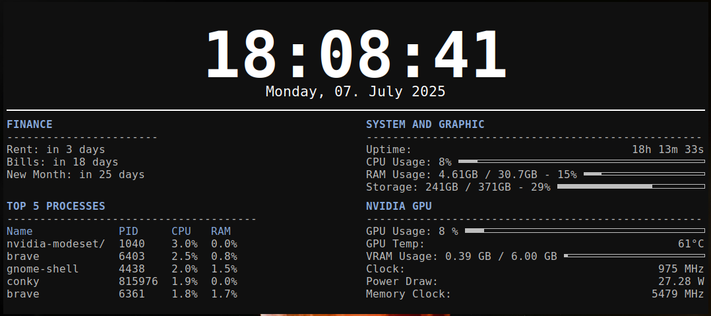
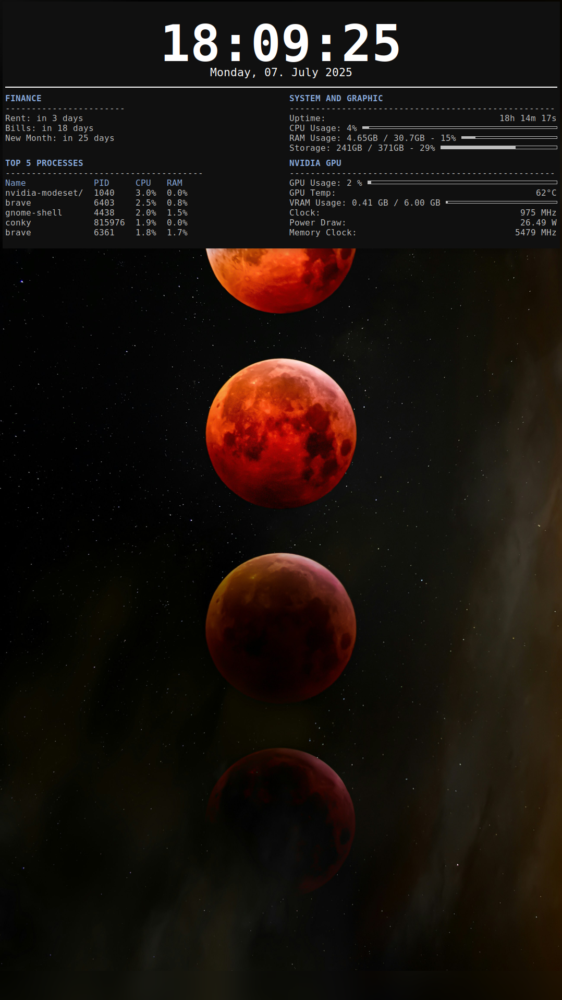

# Custom Conky for a Vertical Side Monitor

This is a personal Conky setup designed specifically for a vertical monitor used as a secondary display. The layout is optimized to place important, at-a-glance information in the primary viewing area, leaving the top of the tall screen free.

## Preview

**Main View**


**Full Screen Context**


## Features

* Large, centered clock with the current date.
* Two-column layout that separates custom information from system stats.
* A helper script that provides a financial countdown for recurring bills/rent dates.
* Detailed system monitoring (CPU, RAM, Storage).
* Dedicated NVIDIA GPU monitoring section.

## Dependencies

* **Conky**: `v1.10` or newer.
* **NVIDIA Drivers**: The `nvidia-smi` command must be installed and available in your system's PATH.
* **Fonts**: `DejaVu Sans Mono` is used by default, but can be easily changed in `conky.conf`.
* **Shell**: Requires `bash` and GNU `date`.

## Installation & Usage

This configuration is portable and can be placed in any directory.

#### 1. Install Dependencies

First, make sure you have Conky local machine:
```bash
sudo apt update
sudo apt install conky-all
```

#### 2. Get the Files

Clone this repository to your local machine:
```bash
git clone https://github.com/vukan322/conky-config.git
```

#### 3. Move to your Directory

Now, move into the newly created directory:
```bash
cd conky-config
```

#### 4. Make the Helper Script Executable

Before running, you must give the date calculation script permission to execute.
```bash
chmod +x conky_days.sh
```

#### 5. Run Conky

To run the configuration, point Conky to the conky.conf file using the -c flag.
```bash
conky -c conky.conf
```

